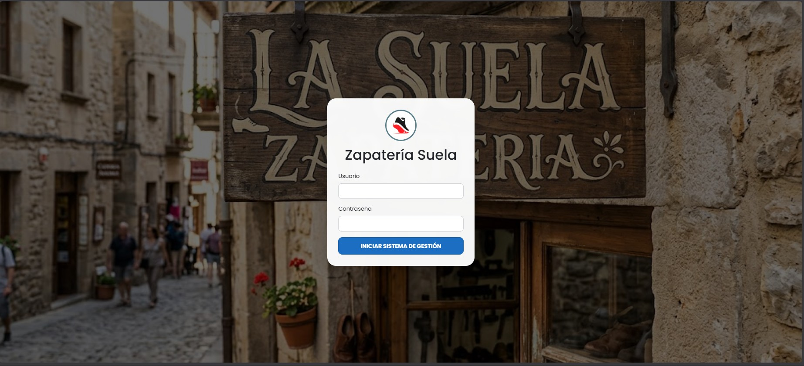
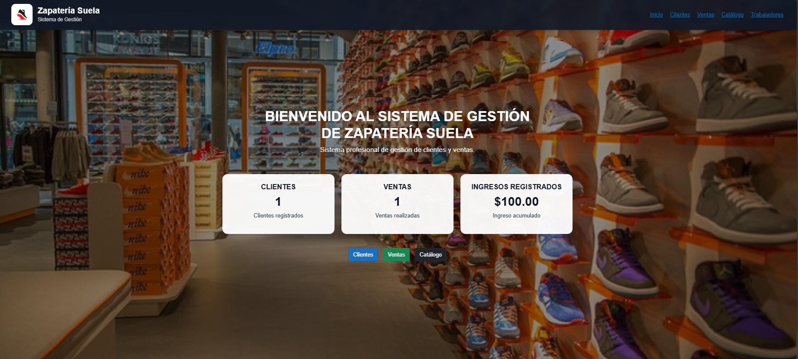
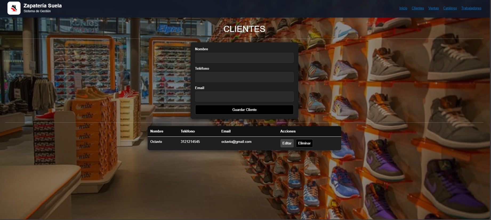
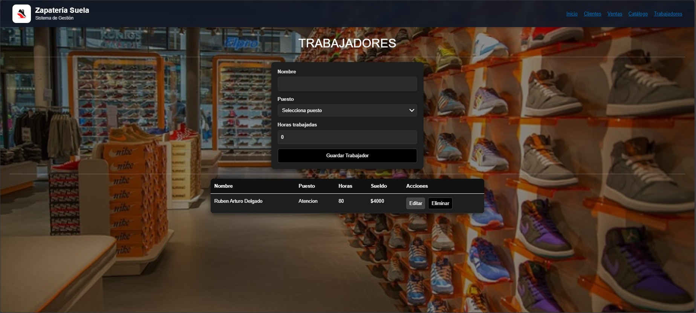
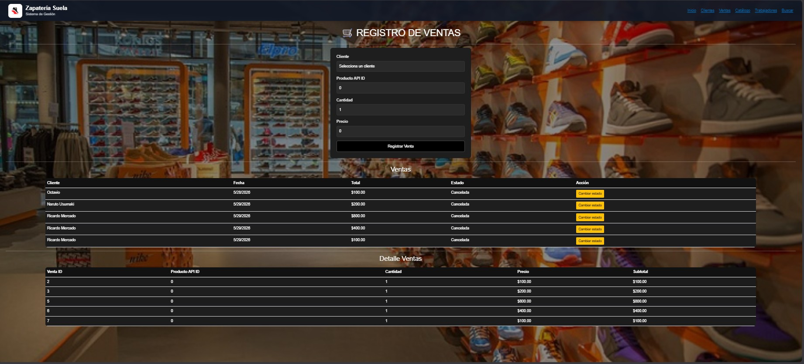

Nombre del sistema:
Zapatería Suela

Negocio o:
Sistema de gestión para Zapateria (ventas, clientes, catálogo y trabajadores)

URL de la API consumida:
https://api-udec-pweb-aedec9hxbugye0am.westus3-01.azurewebsites.net/api/comercio/productos

Productos:
https://api-udec-pweb-aedec9hxbugye0am.westus3-01.azurewebsites.net/api/comercio/productos
Categorías:
https://api-udec-pweb-aedec9hxbugye0am.westus3-01.azurewebsites.net/api/comercio/categorias
Productos por categoría:
https://api-udec-pweb-aedec9hxbugye0am.westus3-01.azurewebsites.net/api/comercio/productos/categoria/{id}

## 🔐 Login

---

## 🏠 Inicio

---

## 👤 Clientes

---

## 👷 Trabajadores

---

## 🛒 Ventas

